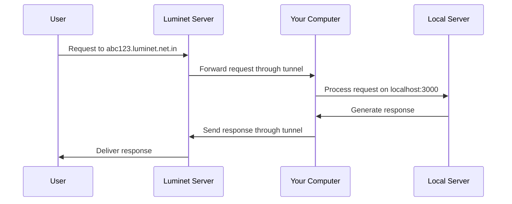

# Luminet

> **Securely expose your local servers to the internet**

<!--  -->

## Overview

Luminet is a powerful developer tool that creates secure tunnels from the public internet to your local development environment. It solves the common challenge of exposing localhost services to external users and services.

```
                                        Public Client
                                            │
                                            ▼
                                    🌍 Public Internet
                                            │
                                            ▼
                                    🌐 Tunneling Server
                                        - Listens for public connections
                                        - Forwards data between phone & local server
                                            │
                                            ▼
                                    🏠 Local Network
                                            │
                                            ▼
                                    📞 Local TCP Server
                                        - Listens on port 8000
                                        - Receives & responds to messages
```

## What is Luminet?

Luminet provides a **public URL** (like `https://xyz123.luminet.net.in`) that tunnels requests to your local machine (like `http://localhost:3000`).

### Key Benefits

- 🚀 **Simple Setup**: One command to expose your local server
- 🔒 **Secure by Default**: TLS encryption throughout the tunnel
- 🌐 **Instant Public Access**: Share your work without deployment
- 🔄 **Real-time Updates**: Changes reflect immediately

## Common Use Cases

| Use Case | Description |
|----------|-------------|
| **Webhook Testing** | Test Stripe, GitHub, or Twilio webhooks locally |
| **Demo Sharing** | Show your work to clients or team members |
| **Mobile Testing** | Access your backend from mobile devices |
| **API Development** | Test your APIs with external services |

## Why Use Tunneling?

Your local development environment typically:

- ❌ Lacks a public IP address
- ❌ Sits behind firewalls or NAT
- ❌ Is inaccessible from the internet

Luminet bridges this gap by:

- ✅ Running a lightweight agent on your machine
- ✅ Creating an encrypted tunnel to public servers
- ✅ Providing a public URL that routes to your localhost

## How Luminet Works

### 1. Connection Establishment

When you run `luminet http 3000`:

1. The Luminet agent connects to Luminet's edge servers
2. It establishes a persistent, encrypted TLS connection
3. It requests exposure of your local port 3000

### 2. Public URL Assignment

Luminet's infrastructure:

1. Assigns a unique subdomain (e.g., `https://abc123.luminet.net.in`)
2. Maps this subdomain to your tunnel session
3. Makes your local server publicly accessible

### 3. Request Handling

When someone accesses your public URL:



## Technical Architecture

Luminet operates as a multi-tenant platform with:

- **Isolated user sessions** for security
- **Subdomain registry** mapping to individual connections
- **Global edge servers** for performance and reliability

```json
{
  "abc123.luminet.net.in": "sessionID_1",
  "user456.luminet.net.in": "sessionID_2"
}
```

## Getting Started

```bash
# Install Luminet
npm install -g luminet

# Start a tunnel to your local server
luminet http 3000

# With custom subdomain (pro accounts)
luminet http 3000 --subdomain=myproject
```

## Advanced Features

- **Real-time inspection** of requests at `localhost:4040`
- **IP whitelisting** for enhanced security
- **Custom subdomains** for consistent access points
- **Authentication** to protect your exposed services

---

<div align="center">
  <p><strong>Ready to tunnel? Get started with Luminet today!</strong></p>
  <a href="https://luminet.net.in">Visit luminet.net.in →</a>
</div>